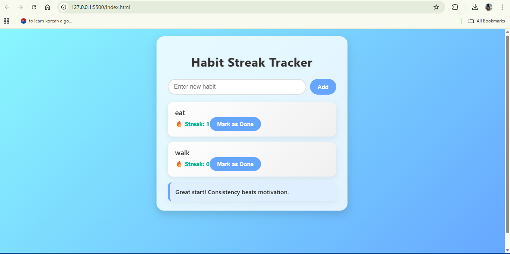

 Project Documentation – Habit Streak Tracker
Project Name:
Habit Streak Tracker

Basic Details
Team Name: Habit Streaktracker
Team Members:
Member 1: Devika Rakesh – SCMS SCHOOL OF ENGINEERING AND TECHNOLOGY

Hosted Project Link:
 Add your project hosted link here

Project Description
Habit Streak Tracker is a web-based tool that helps users build daily habits by tracking streaks, giving motivational tips, and visually showing progress. It encourages consistency and habit formation through an interactive and easy-to-use interface.

The Problem Statement
Many people struggle to maintain daily habits and lose track of their progress, resulting in inconsistent routines and reduced productivity. There is a need for a simple and engaging tool to help users stay motivated and monitor their habits.

The Solution
We provide a web app that allows users to:
Add and track multiple daily habits.

Mark habits as completed and maintain streaks.

Get motivational tips and feedback to encourage consistency.

Store progress locally so data persists across sessions.

Technical Details
Technologies/Components Used
For Software:
Languages Used: JavaScript, HTML, CSS

Frameworks Used:  (Vanilla JS)

Libraries Used:  (built-in browser APIs)

Tools Used: VS Code, Live Server extension, Browser

For Hardware:
Not applicable

Features
Add Habit: Users can create new habits easily.

Mark as Done: Track daily completion with a single click.

Streak Tracker: Automatically calculates and displays consecutive day streaks.

Motivational Tips: Shows tips to encourage consistency.

Persistent Storage: All data saved in LocalStorage for session persistence.

Animations: Streak counters and habit cards animate to improve user experience.

Implementation
For Software:
Installation:
 No backend needed. Simply download the project or clone the repo.
Run:
Open index.html in your browser, or

Use VS Code Live Server to run locally:

 Right-click index.html → Open with Live Server

Project Documentation
Screenshots:

 Home screen showing input for new habits and habit list.

 Streaks updating after marking a habit as done.

 Motivational tips displaying dynamically based on streaks.

Diagrams
System Architecture:
Frontend only application

Data stored in LocalStorage

User actions (Add, Mark Done) trigger JavaScript functions

Streaks and tips are calculated dynamically and displayed in the DOM

Application Workflow:
User opens the web app.

User adds a habit using the input box.

Habit appears in the list with streak = 0.

User clicks “Mark as Done” daily to update streak.

App updates streak counter, stores data in LocalStorage, and shows motivational tip.

Users can continue tracking over days.

Additional Documentation
Demo Output Example:
Input: Add “Morning Exercise” habit
 Action: Mark as done today
 Output: Streak = 1, motivational tip displayed

Team Contributions
Devika Rakesh: Frontend development, JavaScript logic, CSS animations, project documentation.

License
This project is licensed under the MIT License – free to use, copy, and modify.

